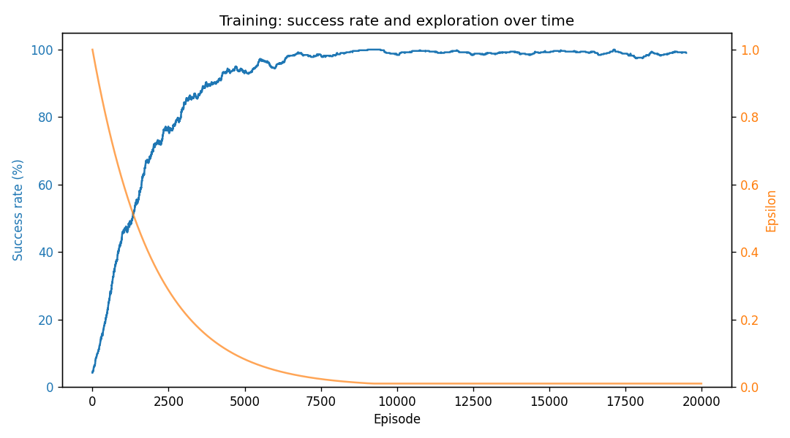

# Frozen Lake from First Principles: Q-Learning

A complete Reinforcement Learning solution to the 8×8 **Frozen Lake** problem, implemented
entirely from scratch in Python. No Gymnasium, OpenAI Gym, Stable Baselines, RLlib, or any
other RL framework is used - the environment, agent, training loop, and evaluation are all
written by hand.

> **Course:** DSCD 614: Reinforcement Learning · Assignment 1
> **Name:** _<Caleb Abakah Mensah>_
> **Student ID:** _<22424188>_

---

## 1. Introduction

### What is Reinforcement Learning?

Reinforcement Learning (RL) is a branch of machine learning in which an **agent** learns to
make decisions by interacting with an **environment**. At each step the agent observes a
**state**, chooses an **action**, and receives a **reward** plus the next state. It is never
told the correct action directly; instead it must discover, through trial and error, a
**policy** (a mapping from states to actions) that maximises the total reward it collects over
time. This is the defining feature of RL, learning from consequences rather than from labelled
examples.

### What is Frozen Lake?

Frozen Lake is a classic grid-world environment. The agent must cross a frozen lake from a
**Start** tile to a **Goal** tile without falling into any **Holes**. The 8×8 map used here is:

```
S F F F F F F F
F F F F F F F F
F F F H F F F F
F F F H F F F F
F F F H F F F F
F H H F F F H F
F H F F H F H F
F F F H F F F G
```

- **S** - Start state (top-left)
- **F** - Frozen, safe to stand on
- **H** - Hole; entering ends the episode in failure
- **G** - Goal; entering ends the episode in success

The agent does not know the map in advance. It must learn a safe path purely from the reward
signal.

---

## 2. Environment Design

### State representation

Each cell is encoded as a **single integer** in the range `0–63`, computed from its grid
position as:

```
state = row * n_cols + col
```

This gives 64 states for the 8×8 grid and keeps the Q-table a simple `64 × 4` array.

### Action representation

There are four actions, encoded exactly as specified by the assignment:

| Action | Code |
|--------|------|
| Left   | 0    |
| Down   | 1    |
| Right  | 2    |
| Up     | 3    |

If an action would move the agent off the grid, the move is clamped and the agent stays in
place (boundary enforcement).

### Reward structure

A sparse reward is used, matching standard Frozen Lake:

| Event | Reward | Episode ends? |
|-------|--------|---------------|
| Reach the Goal | **+1.0** | Yes |
| Fall in a Hole | 0.0 | Yes |
| Step on Frozen ice | 0.0 | No |

Because the only positive reward sits at the distant goal, the agent must rely heavily on
exploration to discover it for the first time.

---

## 3. Q-Learning Algorithm

### Description

Q-Learning is a value-based, model-free RL algorithm. It maintains a **Q-table** of estimates
`Q(s, a)` - the expected long-term value of taking action `a` in state `s`. The table starts
at all zeros and is refined as the agent gathers experience. Once trained, acting optimally is
simply choosing the highest-valued action in each state.

### The update equation

After every transition `(s, a, r, s')`, the relevant Q-value is updated by:

```
Q(s, a) <- Q(s, a) + α [ r + γ · max_a' Q(s', a') − Q(s, a) ]
```

- **TD target** `r + γ · max_a' Q(s', a')` - a better estimate of the value of `(s, a)`:
  the reward just received plus the discounted value of the best action available next.
- **TD error** `target − Q(s, a)` - how wrong the old estimate was.
- **α (learning rate)** controls how far the estimate moves toward the target.
- **γ (discount factor)** controls how much future reward is valued versus immediate reward.

When the next state is terminal (a hole or the goal), there is no future, so the
`γ · max_a' Q(s', a')` term is dropped and the target is simply the reward `r`.

### Exploration strategy

The agent uses **ε-greedy** exploration: with probability ε it takes a random action
(explore), otherwise it takes the best known action (exploit). ε starts at `1.0` (pure
exploration) and **decays** multiplicatively each episode toward a floor of `0.01`, so the
agent explores aggressively at first and increasingly exploits what it has learned. Ties
between equally-valued actions are broken at random to avoid a directional bias.

---

## 4. Training Procedure

### Hyperparameters used

| Hyperparameter | Deterministic | Slippery (bonus) |
|----------------|---------------|------------------|
| Learning rate α | 0.1 | 0.1 |
| Discount factor γ | 0.99 | 0.99 |
| Initial ε | 1.0 | 1.0 |
| Minimum ε | 0.01 | 0.01 |
| ε decay | 0.9995 | 0.9998 (slower) |
| Max steps per episode | 200 | 200 |

### Number of episodes

- **Deterministic environment:** 20,000 episodes
- **Slippery environment (bonus):** 40,000 episodes (stochastic transitions require more
  experience per state, and exploration is kept active for longer via a slower ε decay)

---

## 5. Results

### Final success rate

| Environment | Training success (last 1000) | Evaluation success | Average reward |
|-------------|------------------------------|--------------------|----------------|
| Deterministic | ~99% | **100%** (100/100) | 1.000 |
| Slippery (1/3) | ~89% | **~89%** (over 1000 runs) | ~0.89 |

The training curve below shows the success rate climbing toward 100% as ε decays — the
signature of successful learning.



### Learned policy

The greedy policy extracted from the trained Q-table (deterministic environment). Following the
arrows from `S` traces a safe path to `G` that avoids every hole:

```
↓  ↓  ↓  ↓  ↓  ↓  ↓  ↓
→  →  →  →  ↓  ↓  ↓  ↓
↑  ↑  ↑  H  →  →  ↓  ↓
↑  ↑  ↑  H  →  →  ↓  ↓
↑  ↑  ↑  H  →  →  →  ↓
↑  H  H  →  →  ↑  H  ↓
↑  H  ←  ←  H  ↓  H  ↓
←  ←  ←  H  ←  →  →  G
```

(`←` left · `↓` down · `→` right · `↑` up · `H` hole · `G` goal)

### Discussion of performance

- **Deterministic lake:** the agent learns an optimal route and reaches the goal on every
  evaluation episode. Because transitions are deterministic, the greedy policy follows the same
  path every time, so success is all-or-nothing. here, 100%.
- **Hyperparameter robustness:** on the deterministic lake, every reasonable hyperparameter
  setting converges to a high success rate; differences between settings are small and mostly
  seed-dependent. This is itself a finding.  Q-Learning is very robust when the dynamics are
  predictable.
- **Slippery lake (bonus):** with stochastic transitions the success rate drops below 100%,
  because an unlucky slip near a hole can end an episode despite a sound policy. The agent
  responds by learning a **more cautious, wall-hugging policy** that keeps a safety margin from
  holes — for example preferring to move along walls so that a perpendicular slip is harmless.
  Notably, the Q-Learning algorithm itself is unchanged; only the environment becomes
  stochastic, demonstrating that the method naturally handles randomness by learning from the
  transitions it actually experiences.
- **Unvisited states:** cells the agent rarely visits (e.g. pockets sealed off by holes) keep
  near-zero Q-values, so their extracted action is essentially arbitrary. This is expected,
  the agent only learns good actions where it has gathered experience.

---

## 6. Stochastic ("Slippery") Transitions

The bonus implements **Option A: stochastic transitions** (`SlipperyFrozenLakeEnv`). When the
agent chooses an action, it moves in the intended direction with probability `p_intended`
(default `1/3`); otherwise it slips to one of the two perpendicular directions, each equally
likely. Setting `p_intended = 1.0` recovers the deterministic environment. The training-curve
plot additionally satisfies the visualization bonus (Option B).

---

## 7. Execution Instructions

### Requirements

```bash
pip install -r requirements.txt
```

(Only `numpy` is required to run; `matplotlib` is used to save the training-curve plot.)

### Train the agent

```bash
# Deterministic environment (core task)
python train.py

# Stochastic / slippery environment 
python train.py --slippery

# Experiment with hyperparameters
python train.py --episodes 30000 --alpha 0.5 --gamma 0.9 --epsilon-decay 0.999
```

Training writes the learned Q-table, a run configuration, summary statistics, and a
training-curve plot into the `results/` directory.

### Evaluate the trained agent

```bash
python evaluate.py                 # 100 episodes (default)
python evaluate.py --episodes 1000 # more episodes for a stable estimate
```

`evaluate.py` automatically rebuilds the same environment that was used for training (by
reading `results/run_config.json`), prints the learned policy and per-state actions, and reports
the success rate, average reward, number of failures, and number of successful runs.

---

## Repository Structure

```
frozen-lake-qlearning/
├── environment.py      # FrozenLakeEnv + SlipperyFrozenLakeEnv
├── agent.py            # QLearningAgent
├── train.py            # training loop + CLI
├── evaluate.py         # evaluation + policy extraction + CLI
├── requirements.txt
├── README.md
├── report.pdf          # technical report
└── results/            # generated outputs (Q-table, plots, metrics)
```
